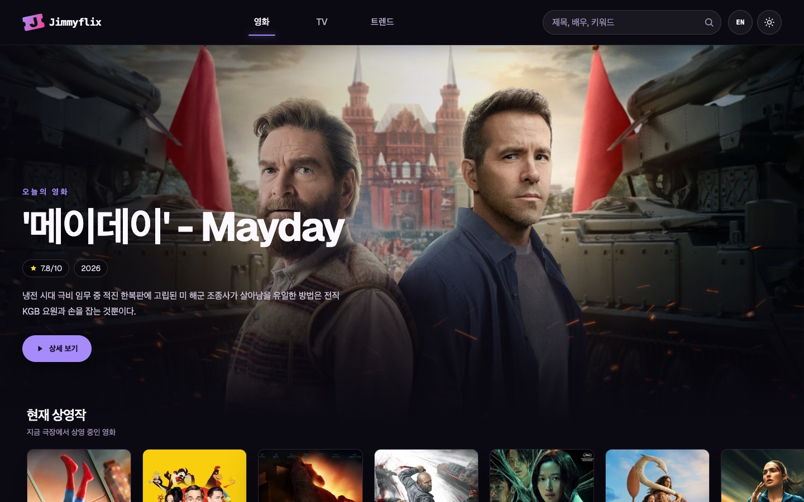
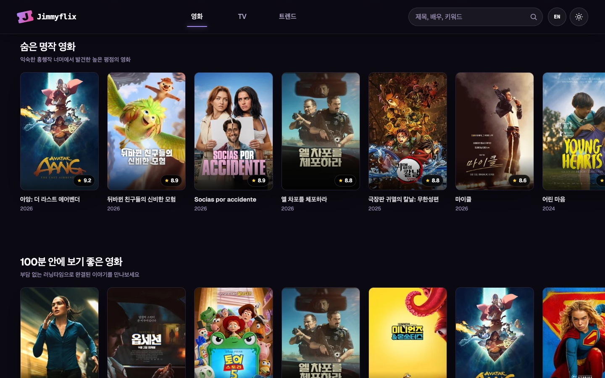
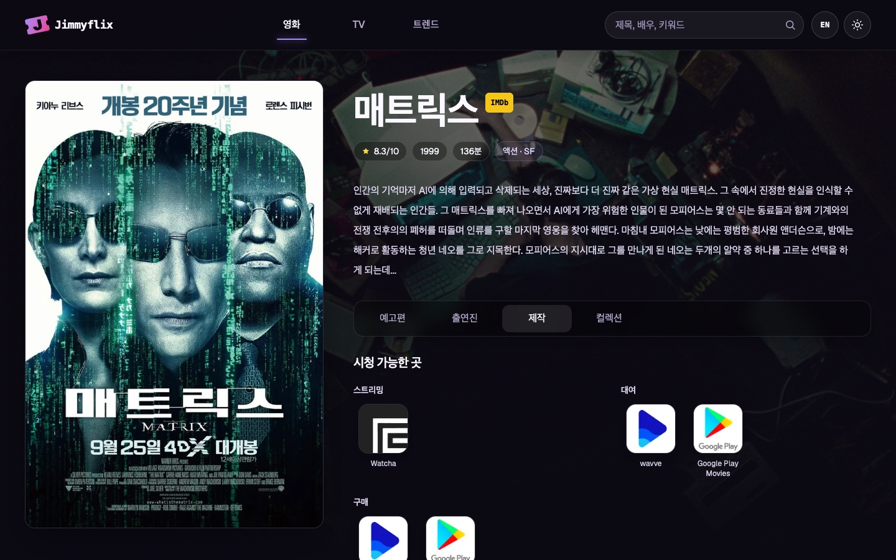
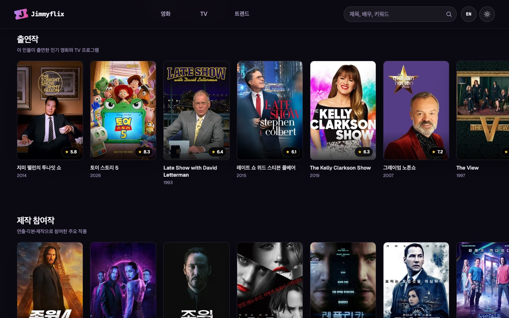
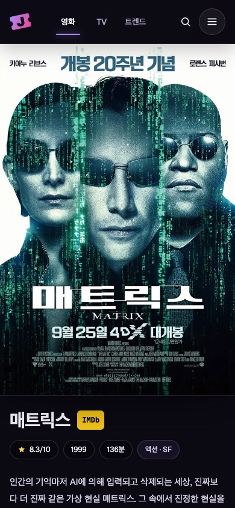
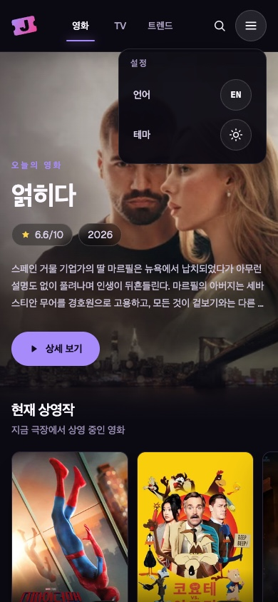
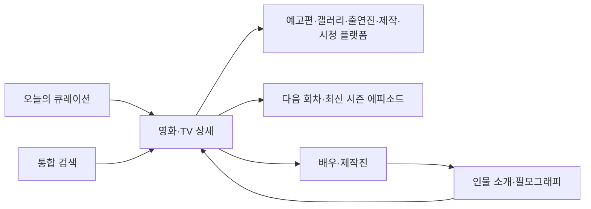

  

<h1 align="center">Jimmyflix</h1>

  오늘 볼 작품을 발견하고 인물과 필모그래피도 자연스럽게 탐색할 수 있는 영화 · TV 웹 애플리케이션

  <a href="https://jimmyflix.vercel.app"><strong>서비스 바로가기 →</strong></a>

  <code>Next.js 16</code>
  <code>React 19</code>
  <code>TypeScript</code>
  <code>Tailwind CSS 4</code>
  <code>TMDB API</code>
  <code>Vercel</code>

## 홈 화면

Jimmyflix는 인기 순위만 나열하는 대신 여러 관점의 큐레이션을 제공합니다. 영화와 TV를 각각 탐색하면서 현재 상영·방영작, 숨은 명작, 짧은 영화, 미니시리즈, 국가·주제 특집을 만날 수 있습니다. OTT 서비스별 작품과 매일 바뀌는 이야기 주제, 매주 교체되는 시대·포맷 컬렉션, 지역 기준 45일 공개 캘린더가 다시 방문할 이유를 만듭니다.

| 발견 | 탐색 | 개인화 | 사용 환경 |
| --- | --- | --- | --- |
| 영화·TV별 다층 큐레이션 | 예고편, 이미지 갤러리, 출연진·제작진 | 최근 본 작품을 기기에 저장 | 한국어·영어 지원 |
| OTT 서비스별 작품 선택 | 다음 회차와 최신 시즌 에피소드 | 평점이 있을 때만 배지 표시 | 시스템 기본 테마와 수동 전환 |
| 일간 주제·주간 시대 및 포맷 특집 | 시청 플랫폼, 컬렉션, 관련 추천작 | 검색어와 탐색 조건을 URL에 유지 | 모바일·데스크톱 반응형 UI |

익숙한 흥행작뿐 아니라 높은 평가를 받은 작품, 부담 없이 볼 수 있는 짧은 영화, 국가와 장르를 기준으로 고른 콘텐츠를 가로 슬라이드로 탐색할 수 있습니다. 데스크톱에서는 목록 가장자리에 포인터를 가져가면 이동 버튼이 나타나고, 모바일에서는 자연스러운 터치 스크롤을 사용합니다.

## 상세 페이지

포스터와 고화질 배경, 줄거리, 장르, 러닝타임을 먼저 보여줍니다. 작품 키워드로 관련 검색을 바로 이어갈 수 있고, 예고편과 이미지 갤러리, 출연진, 핵심 제작진, 제작사·국가, 시청 플랫폼, 컬렉션 또는 시즌, 관련 추천작을 한 화면에서 확인할 수 있습니다. TV 상세에서는 다음 공개 회차와 최신 시즌의 에피소드별 이미지·줄거리도 제공합니다.

배우와 제작진 이름을 선택하면 인물 소개와 기본 정보, 출연작, 제작 참여작으로 이동합니다. 작품 상세에서 인물로, 다시 필모그래피 속 다른 작품으로 이어지는 탐색 흐름을 제공합니다.

## 모바일 화면

모바일 상세는 포스터를 화면 너비로 크게 보여주고 그 아래에 제목과 핵심 정보를 배치합니다. 헤더의 설정 메뉴에서 언어와 테마를 함께 바꿀 수 있으며, 선택한 언어와 테마는 다음 방문에도 유지됩니다.

<table>
  <tr>
    <td width="50%" align="center">
      
    </td>
    <td width="50%" align="center">
      
    </td>
  </tr>
  <tr>
    <td align="center">화면을 채우는 포스터와 핵심 정보</td>
    <td align="center">언어와 테마를 모은 모바일 설정</td>
  </tr>
</table>

## 검색

하나의 검색창에서 영화·TV 제목, 배우 이름, 주제 키워드를 검색할 수 있습니다. 인물 이름은 해당 인물의 출연·제작 참여작으로, 주제 키워드는 관련 영화와 TV 프로그램으로 확장됩니다.

## 기술 스택

| 영역 | 구성 |
| --- | --- |
| 프레임워크 | Next.js 16 App Router, React 19 Server Components |
| 언어·스타일 | TypeScript strict mode, Tailwind CSS 4 |
| 데이터 | 서버에서 TMDB API 호출, Next.js Data Cache |
| 이미지 | `next/image`, 화면 크기와 용도에 맞춘 TMDB 이미지 소스 |
| 현지화 | 한국어·영어 URL, 서버 UI 사전, 언어별 TMDB 응답 |
| 상태 | 검색 조건은 URL, 최근 본 작품·언어·테마는 브라우저에 저장 |
| 배포 | Vercel, Node.js 24 |

데이터 요청은 Server Component에서 시작하고 독립된 목록을 병렬로 불러옵니다. 화면별 `Suspense` 경계와 실제 콘텐츠 크기에 맞춘 스켈레톤을 사용해 먼저 준비된 영역부터 보여주며 레이아웃 이동을 줄입니다. TMDB API 키는 브라우저에 전달하지 않습니다.

## 데이터 출처

영화·TV·인물 데이터와 이미지는 [TMDB](https://www.themoviedb.org/) API를 사용합니다. 스트리밍 제공 정보는 TMDB의 Watch Providers 응답을 통해 제공되며 JustWatch 출처를 화면에 표시합니다. Jimmyflix는 TMDB의 공식 제품이 아니며 TMDB의 보증을 받지 않습니다.
