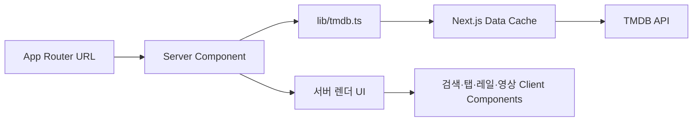

# App Router·Tailwind 전환 기록

작성일: 2026-09-10

이 문서는 Jimmyflix 3.0 구조 전환의 목표, 최종 구조, 주요 설계 결정과 검증 범위를 기록한다. 전환 전 상태와 문제 근거는 [저장소 진단](repository-review.md), UI 과제와 수용 기준은 [UI/UX 개선 백로그](ui-ux-backlog.md), 단계별 반영 이력은 [개선 작업 진행 기록](improvement-progress.md)에서 확인한다.

## 전환 결과

| 영역 | 이전 | 전환 후 |
| --- | --- | --- |
| 라우팅 | Next.js 12 Pages Router | Next.js 16 App Router |
| 렌더링 | `getServerSideProps` + 클라이언트 재조회 | React Server Components에서 서버 조회 |
| 스타일 | Emotion 런타임 CSS | Tailwind CSS 4 정적 유틸리티 |
| 목록 슬라이드 | react-slick + 외부 slick CSS | 기본 `overflow-x` + CSS scroll snap |
| 원격 상태 | React Query 3 | Next.js `fetch` 캐시와 서버 렌더링 |
| 화면 상태 | Recoil | URL 검색 파라미터와 지역 상태 |
| HTTP | Axios | 표준 `fetch` |
| 이미지 | 배경 이미지와 일반 `img` 중심 | `next/image`와 용도별 TMDB 이미지 크기 |
| 패키지 설치 | Yarn PnP, 저장소에 캐시 포함 | Yarn `node_modules`, 캐시 미추적 |

직접 의존성은 24개에서 3개로 줄었다. 브라우저로 보내는 상태 관리·스타일·슬라이더 런타임도 제거했다.

## 최종 구조

```text
app/
├── layout.tsx             전역 메타데이터, 글꼴, 공통 헤더
├── page.tsx               영화 목록
├── tvs/page.tsx           TV 목록
├── trend/page.tsx         URL 기반 일간·주간 트렌드
├── search/page.tsx        URL 기반 영화·TV 검색
├── movies/[id]/page.tsx   영화 상세
├── tvs/[id]/page.tsx      TV 상세
├── loading.tsx            라우트 전환 스켈레톤
├── error.tsx              복구 가능한 오류 경계
└── not-found.tsx          사용자 제어형 404

components/
├── media-card.tsx         공통 2:3 작품 카드
├── media-rail.tsx         기본 스크롤 기반 가로 목록
├── hero.tsx               목록 대표 작품 영역
├── search-form.tsx        검증을 포함한 검색 폼
├── detail-view.tsx        영화·TV 공통 상세 레이아웃
├── detail-tabs.tsx        접근 가능한 탭 상호작용
├── detail-panels.tsx      예고편·출연진·제작·시즌·컬렉션
└── video-embed.tsx        클릭 후 로드하는 16:9 플레이어

lib/
├── tmdb.ts                서버 요청, 캐시, 오류 분류, 병렬 조회
└── media.ts               표시값과 이미지·상세 URL 생성
```



## 데이터와 오류 처리

- `lib/tmdb.ts`만 API 키를 읽고 TMDB를 호출한다. 키가 클라이언트 컴포넌트의 props나 브라우저 요청 URL에 포함되지 않는다.
- 목록·검색처럼 독립적인 요청은 `Promise.allSettled`로 병렬 실행한다. 한 섹션이 실패해도 성공한 섹션과 조작 컨트롤을 유지한다.
- 같은 렌더 요청 안의 상세·메타데이터 조회는 React `cache`로 중복을 줄인다. TMDB 응답은 콘텐츠 종류에 따라 5분, 10분, 30분 재검증 정책을 사용한다.
- 상세 경로의 ID를 양의 안전 정수로 제한한다. TMDB의 404는 `notFound()`로 보내고, 일시적인 서버 오류는 App Router 오류 경계에서 다시 시도할 수 있다.
- 검색어 `q`와 트렌드 기간 `window`를 URL에 보존한다. 직접 접근, 새로고침, 공유, 뒤로가기에서 동일한 화면을 복원한다.

## 목록 탐색 방식

react-slick의 무한 복제 슬라이드는 브라우저 기본 가로 스크롤로 교체했다.

- 모바일은 손가락 스크롤과 관성 이동을 그대로 사용한다.
- 카드에는 `scroll-snap-align: start`, 목록에는 `scroll-snap-type: x mandatory`를 적용한다.
- 데스크톱 화살표는 현재 목록 너비의 약 82%만큼 부드럽게 이동한다.
- DOM 복제와 외부 slick CSS가 없어 읽기 순서가 단순하고, 모든 카드를 기본 스크롤 동작으로 탐색할 수 있다.
- 포스터는 2:3 비율, 제목은 두 줄, 평점·연도·매체 유형은 항상 표시한다.

## 상세 화면과 미디어

- 모바일 첫 화면은 작은 포스터 옆에 제목·평점·연도·상영시간·장르를 배치한다.
- 예고편 컨테이너는 `width: 100%`, 최대 1100px, `aspect-ratio: 16 / 9`다. iframe은 컨테이너를 완전히 채운다.
- 공식 YouTube Trailer를 우선 선택하고, 없으면 일반 YouTube Trailer를 사용한다. 영상이 없으면 빈 플레이어 대신 설명을 표시한다.
- 초기 HTML에는 YouTube iframe을 넣지 않는다. 사용자가 재생 버튼을 누르면 `youtube-nocookie.com` 플레이어를 로드한다.
- Credits·Production·Seasons·Collection은 `flex-wrap`과 `justify-center`를 사용한다. 모바일에서 마지막 줄의 항목 수가 홀수여도 마지막 카드가 중앙에 놓인다.
- 인물 사진, 제작사 로고, 국기에는 모두 `object-position: center`를 적용한다. 로고는 `object-fit: contain`, 인물과 국기는 목적에 맞는 고정 비율을 사용한다.

## 접근성

- 공통 헤더는 `header`·`nav`, 각 페이지는 하나의 `main`, 목록 제목은 순서가 맞는 heading을 사용한다.
- 현재 메뉴와 기간에는 `aria-current`를 제공한다.
- 상세 탭은 `tablist`·`tab`·`tabpanel`, 선택 상태, 연결 ID를 제공한다. 좌우 화살표와 Home·End 키로 이동한다.
- 모든 아이콘 버튼, 검색 입력, 작품 링크에 접근 가능한 이름이 있다.
- 키보드 포커스는 배경과 구분되는 링으로 표시한다.
- `prefers-reduced-motion`에서는 애니메이션과 부드러운 전환 시간을 줄인다.

## 반응형 기준

| 너비 | 핵심 동작 |
| --- | --- |
| 320–479px | 헤더 텍스트 로고 생략, 상세 포스터+정보 2열, 카드 목록 2열, 가로 레일 터치 조작 |
| 480–767px | 카드와 상세 정보 간격 확대 |
| 768–1023px | 상세 배경 표시, 검색 결과 4열까지 확장 |
| 1024px 이상 | 큰 상세 포스터와 정보 패널 2열, 레일 화살표 제공 |
| 1440px 이상 | 콘텐츠 최대 너비 제한, 넓은 화면의 과도한 카드 확대 방지 |

## 확인한 수용 기준

- Next.js 16 프로덕션 빌드와 TypeScript strict 검사를 통과한다.
- 데스크톱 상세의 예고편 영역은 가용 콘텐츠 너비를 사용하고 16:9를 유지한다.
- 375px 상세의 예고편 영역은 343×193px이며 페이지 가로 넘침이 없다.
- 375px Credits·Production fixture에서 홀수 번째 마지막 카드의 중심은 뷰포트 중심 187.5px와 일치한다.
- 예고편 재생 후 iframe도 동일 영역을 채우며 전체 화면 권한을 유지한다.
- 좌우 방향키로 상세 탭을 변경할 수 있다.
- 데스크톱 레일의 다음 버튼과 모바일 기본 가로 스크롤로 숨은 카드에 도달할 수 있다.
- 오류 오버레이, hydration 오류, 브라우저 페이지 오류가 없다.

실제 TMDB 정상 데이터와 Vercel 런타임 검증은 배포 승인 후 프리뷰에서 다시 수행한다. Vercel에는 `TMDB_API_KEY`를 서버 전용 환경 변수로 설정하고, 전환 기간이 끝나면 `NEXT_PUBLIC_API_KEY` 호환 경로를 제거한다.

## 남은 개선 후보

1. 실제 기기와 보조 기술에서 터치·탭 읽기 순서를 확인한다.
2. Speed Insights 또는 동일 조건의 Lighthouse로 LCP·CLS 기준선을 수집한다.
3. 원격 이미지 로드 실패 시 로컬 이미지로 교체하는 공통 래퍼를 추가한다.
4. 검색 결과가 많아질 경우 페이지네이션이나 더 보기 기능을 추가한다.
5. 언어 정책을 정한 뒤 UI 문구와 TMDB `language` 값을 함께 국제화한다.
