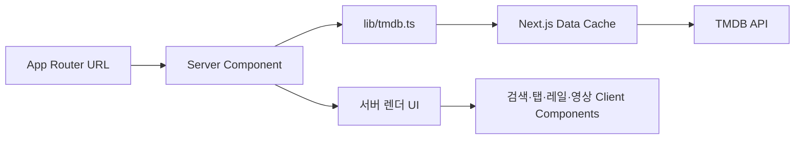

# App Router·Tailwind 전환 기록

작성일: 2026-09-10

이 문서는 Jimmyflix 3.0 구조 전환의 목표, 최종 구조, 주요 설계 결정과 검증 범위를 기록한다. 전환 전 상태와 문제 근거는 [저장소 진단](repository-review.md), UI 과제와 수용 기준은 [UI/UX 개선 백로그](ui-ux-backlog.md), 단계별 반영 이력은 [개선 작업 진행 기록](improvement-progress.md)에서 확인한다.

## 전환 결과

| 영역 | 이전 | 전환 후 |
| --- | --- | --- |
| 라우팅 | Next.js 12 Pages Router | Next.js 16 App Router |
| 렌더링 | `getServerSideProps` + 클라이언트 재조회 | React Server Components에서 서버 조회 |
| 스타일 | Emotion 런타임 CSS | Tailwind CSS 4 정적 유틸리티 |
| 목록 슬라이드 | react-slick + 외부 slick CSS | 기본 `overflow-x` + CSS scroll snap |
| 원격 상태 | React Query 3 | Next.js `fetch` 캐시와 서버 렌더링 |
| 화면 상태 | Recoil | URL 검색 파라미터와 지역 상태 |
| HTTP | Axios | 표준 `fetch` |
| 이미지 | 배경 이미지와 일반 `img` 중심 | `next/image`와 용도별 TMDB 이미지 크기 |
| 패키지 설치 | Yarn PnP, 저장소에 캐시 포함 | Yarn `node_modules`, 캐시 미추적 |

직접 의존성은 24개에서 3개로 줄었다. 브라우저로 보내는 상태 관리·스타일·슬라이더 런타임도 제거했다.

## 최종 구조

```text
app/
├── layout.tsx             전역 메타데이터, 글꼴, 공통 헤더
├── (home)/                `/` 영화 목록과 전용 로딩 경계
├── tvs/                   TV 목록과 전용 로딩 경계
├── trend/page.tsx         URL 기반 트렌드와 결과 스트리밍
├── search/page.tsx        URL 기반 검색과 결과 스트리밍
├── movies/[id]/           영화 상세와 전용 로딩 경계
├── tvs/[id]/              TV 상세와 전용 로딩 경계
├── error.tsx              복구 가능한 오류 경계
└── not-found.tsx          사용자 제어형 404

components/
├── catalog-content.tsx   섹션별 서버 데이터 스트리밍
├── media-card.tsx         공통 2:3 작품 카드
├── media-rail.tsx         서버 렌더 기반 가로 목록
├── media-rail-controls.tsx 레일 버튼만 담당하는 Client Component
├── hero.tsx               목록 대표 작품 영역
├── search-form.tsx        검증을 포함한 검색 폼
├── header-search.tsx      헤더 통합 검색, 모바일 펼침·포커스·URL 복원
├── detail-view.tsx        영화·TV 공통 상세 레이아웃
├── detail-tabs.tsx        접근 가능한 탭 상호작용
├── detail-panels.tsx      예고편·출연진·제작·시즌·컬렉션
├── loading-skeletons.tsx  화면별 반응형 스켈레톤
└── video-embed.tsx        클릭 후 로드하는 16:9 플레이어

lib/
├── tmdb.ts                서버 요청, 캐시, 오류 분류, 독립 요청 시작
├── search.ts              제목·인물·주제 검색 합치기, 후보·결과 수 제한
└── media.ts               표시값과 이미지·상세 URL 생성
```



## 데이터와 오류 처리

- `lib/tmdb.ts`만 API 키를 읽고 TMDB를 호출한다. 키가 클라이언트 컴포넌트의 props나 브라우저 요청 URL에 포함되지 않는다.
- 영화·TV·트렌드의 섹션 요청은 같은 렌더에서 모두 시작하고 요청별 Promise를 가장 가까운 `Suspense` 경계에 전달한다. 통합 검색은 영화·TV 제목, 인물, 주제를 병렬로 조회하고 참여 크레딧·주제별 목록으로 확장한다. 어느 경우든 한 요청이 실패해도 성공한 결과와 조작 컨트롤을 유지한다.
- 같은 렌더 요청 안의 상세·메타데이터 조회는 React `cache`로 중복을 줄인다. TMDB 응답은 콘텐츠 종류에 따라 5분, 10분, 30분 재검증 정책을 사용한다.
- 상세 경로의 ID를 양의 안전 정수로 제한한다. TMDB의 404는 `notFound()`로 보내고, 일시적인 서버 오류는 App Router 오류 경계에서 다시 시도할 수 있다.
- 검색어 `q`와 트렌드 기간 `window`를 URL에 보존한다. 직접 접근, 새로고침, 공유, 뒤로가기에서 동일한 화면을 복원한다.
- Search 메뉴와 본문의 중복 검색창은 헤더 검색창 하나로 통합했다. 모바일에서는 돋보기로 펼치며, 지원 범위·요청 제한·검증은 [통합 검색](search.md)에 기록했다.

## 로딩과 스트리밍

Server Component도 TMDB 네트워크 응답을 기다려야 하므로 로딩 경계는 유지하되, 모든 경로를 덮던 단일 `app/loading.tsx`는 제거했다.

- 영화 홈은 URL을 바꾸지 않는 `(home)` Route Group에 목록 전용 경계를 두고, TV와 영화·TV 상세에도 가장 가까운 세그먼트의 `loading.tsx`만 사용한다.
- 목록 로딩은 실제 히어로 높이, 2:3 카드 너비, 레일 간격을 그대로 사용한다. 상세 로딩은 모바일 포스터·정보 2열과 데스크톱 상세 grid, 16:9 예고편 영역을 그대로 예약한다.
- 검색창과 검색어 제목은 먼저 렌더하고 영화·TV 결과만 `Suspense`에서 스트리밍한다. 새 검색어에는 별도 경계 key를 사용해 이전 결과 대신 해당 결과 스켈레톤을 보여준다.
- 트렌드 제목과 Today·This week 선택은 계속 조작할 수 있고, 기간이 바뀌면 결과 레일만 스켈레톤으로 전환된다.
- 영화·TV 히어로는 우선순위가 가장 높은 성공 섹션이 준비되는 즉시 렌더한다. 나머지 섹션은 각자의 Promise가 끝나는 순서대로 표시하므로 가장 느린 API 응답이 첫 콘텐츠와 다른 레일을 막지 않는다.
- 상세의 핵심 정보와 Trailer·Production 탭은 상세 응답 직후 렌더한다. Credits와 Collection 요청은 별도 `Suspense` 경계에서 진행되어 부가 정보가 핵심 화면을 막지 않는다.
- 시각 스켈레톤은 접근성 트리에서 숨기고, 로딩 영역의 이름을 상태 메시지로 제공한다. 움직임 감소 설정에서는 pulse 애니메이션을 멈춘다.

## 목록 탐색 방식

react-slick의 무한 복제 슬라이드는 브라우저 기본 가로 스크롤로 교체했다.

- 모바일은 손가락 스크롤과 관성 이동을 그대로 사용한다.
- 카드에는 `scroll-snap-align: start`, 목록에는 `scroll-snap-type: x mandatory`와 반응형 `scroll-padding`을 적용한다. 시작과 끝에서도 모바일 20px, 태블릿 32px, 데스크톱 48px의 좌우 여백을 유지한다.
- 데스크톱 화살표는 레일 양 끝의 넓은 hover 영역에 겹쳐 두고 300ms 투명도 전환으로 표시한다. 아이콘과 감지 영역은 큰 화면에서 각각 40px, 96px이며 현재 목록 너비의 약 82%만큼 부드럽게 이동한다. 시작에서는 이전 버튼, 끝에서는 다음 버튼을 비활성화한다.
- DOM 복제와 외부 slick CSS가 없어 읽기 순서가 단순하고, 모든 카드를 기본 스크롤 동작으로 탐색할 수 있다.
- 레일 본문과 카드는 Server Component로 렌더하고 좌우 버튼만 작은 Client Component로 분리한다. 화면 밖 레일에는 `content-visibility: auto`와 고유 높이를 적용해 초기 style·layout·이미지 작업을 미룬다.
- 포스터는 2:3 비율, 제목은 두 줄로 표시한다. 평점이 있을 때만 배지를 표시하고, 제목 아래에는 연도를 표시한다. 영화·TV는 목록별로 구분하므로 카드에 유형을 반복 표시하지 않는다.

## 상세 화면과 미디어

- 모바일 첫 화면은 작은 포스터 옆에 제목·평점·연도·상영시간·장르를 배치한다.
- 데스크톱 포스터 열은 화면 너비에 따라 최대 480px까지 넓혀 2:3 비율의 세로 길이를 확보하고, 오른쪽 영상·정보 영역과의 높이 균형을 맞춘다.
- 예고편 컨테이너는 `width: 100%`, 최대 1100px, `aspect-ratio: 16 / 9`다. iframe은 컨테이너를 완전히 채운다.
- 공식 YouTube Trailer를 우선 선택하고, 없으면 일반 YouTube Trailer를 사용한다. 영상이 없으면 빈 플레이어 대신 설명을 표시한다.
- 초기 HTML에는 YouTube iframe을 넣지 않는다. 사용자가 재생 버튼을 누르면 `youtube-nocookie.com` 플레이어를 로드한다.
- 예고편 썸네일도 기본 lazy loading을 사용해 상세 포스터와 초기 네트워크 우선순위를 경쟁하지 않는다.
- Credits·Production·Seasons·Collection은 `flex-wrap`을 사용한다. 모바일에서는 마지막 줄의 항목 수가 홀수여도 마지막 카드가 중앙에 놓이고, 데스크톱에서는 카드 목록을 콘텐츠 영역 왼쪽에 맞춘다.
- 인물 사진, 제작사 로고, 국기에는 모두 `object-position: center`를 적용한다. 로고는 `object-fit: contain`, 인물과 국기는 목적에 맞는 고정 비율을 사용한다.
- 브라우저 favicon과 헤더는 선택한 J Ticket 심볼을 사용한다. 티켓 외곽과 J 내부는 투명하며, 배경 없는 SVG·다중 해상도 ICO로 작은 크기의 시인성을 확보한다.

## 테마

- 헤더 토글로 다크·라이트 모드를 전환하고 선택을 저장한다. 저장된 선택이 없으면 기기 설정을 따른다.
- 초기 head 스크립트와 CSS 색상 변수로 서버 렌더링을 유지하면서 첫 화면에 올바른 테마를 적용한다.
- 홈·검색·트렌드·상세·로딩·오류 UI를 모두 같은 테마 토큰으로 구성한다.
- 동작과 검증 내용은 [appearance.md](appearance.md)에 기록했다.

## 접근성

- 공통 헤더는 `header`·`nav`, 각 페이지는 하나의 `main`, 목록 제목은 순서가 맞는 heading을 사용한다.
- 현재 메뉴와 기간에는 `aria-current`를 제공한다.
- 상세 탭은 `tablist`·`tab`·`tabpanel`, 선택 상태, 연결 ID를 제공한다. 좌우 화살표와 Home·End 키로 이동한다.
- 모든 아이콘 버튼, 검색 입력, 작품 링크에 접근 가능한 이름이 있다.
- 키보드 포커스는 배경과 구분되는 링으로 표시한다.
- `prefers-reduced-motion`에서는 애니메이션과 부드러운 전환 시간을 줄인다.

## 반응형 기준

| 너비 | 핵심 동작 |
| --- | --- |
| 320–479px | 헤더 텍스트 로고 생략, 상세 포스터+정보 2열, 카드 목록 2열, 가로 레일 터치 조작 |
| 480–767px | 카드와 상세 정보 간격 확대 |
| 768–1023px | 상세 배경 표시, 검색 결과 4열까지 확장 |
| 1024px 이상 | 큰 상세 포스터와 정보 패널 2열, 레일 화살표 제공 |
| 1440px 이상 | 콘텐츠 최대 너비 제한, 넓은 화면의 과도한 카드 확대 방지 |

## Core Web Vitals와 성능

Chrome DevTools MCP 1.9.0으로 프로덕션 빌드의 고정 fixture를 측정했다. 조건은 390×844, DPR 3, Slow 4G, CPU 4배 감속이며 히어로 1개와 20장짜리 레일 4개를 사용했다. 아래 값은 실제 사용자 데이터가 아닌 같은 로컬 환경에서 변경 전후를 비교한 실험실 수치다. 캐시 편차를 줄이기 위해 두 번째 측정값을 비교했다.

| 지표 | 변경 전 | 변경 후 | 결과 |
| --- | ---: | ---: | ---: |
| LCP | 781ms | 743ms | 38ms, 4.9% 감소 |
| CLS | 0.00 | 0.00 | 레이아웃 이동 없음 유지 |
| 레일 버튼 상호작용 Event Timing | 24ms | 16ms | 8ms, 33% 감소 |
| 초기 resource encoded body 합계 | 509,346B | 373,012B | 136,334B, 26.8% 감소 |
| 초기 이미지 요청 | 6개 | 3개 | 화면 밖 이미지 작업 3개 지연 |
| 자동 RSC fetch | 14개 | 0개 | 미선택 경로 선행 요청 제거 |

- 히어로와 상세 포스터를 `loading="eager"`, `fetchPriority="high"`로 표시했다. DevTools의 LCP discovery 세 검사는 변경 후 모두 통과했고, 네트워크 우선순위도 Low에서 High로 바뀌었다.
- TMDB backdrop 원본 대신 `w1280` 소스를 사용해 이미지 최적화 서버가 가져오고 디코딩할 원본 크기를 제한했다.
- 카드·히어로·공통 내비게이션·트렌드 기간 링크의 자동 prefetch를 끄고 실제 조작 시 가장 가까운 로딩 경계로 전환한다. 초기 화면에서 사용자가 선택하지 않은 정적 카탈로그와 동적 상세 RSC payload가 네트워크·메인 스레드를 점유하지 않게 한다.
- 포스터와 예고편에는 2:3·16:9 비율을 계속 예약해 이미지 지연 로드와 스트리밍 중에도 CLS 0.00을 유지했다.
- DevTools의 DOM size 진단은 변경 전 전체 layout 대상 1,282개와 42ms layout update를 보고했지만 변경 후에는 DOM size 문제가 탐지되지 않았다.
- CSS render blocking과 Next.js 호환용 legacy JavaScript 진단은 각각 예상 LCP 절감 0ms였으므로 빌드 파이프라인을 복잡하게 만드는 변경은 적용하지 않았다.

## 확인한 수용 기준

- Next.js 16 프로덕션 빌드와 TypeScript strict 검사를 통과한다.
- 영화·TV·트렌드의 독립 섹션이 개별 `Suspense` 경계에서 렌더되고 한 섹션 오류가 다른 섹션을 막지 않는다.
- 데스크톱 상세의 예고편 영역은 가용 콘텐츠 너비를 사용하고 16:9를 유지한다.
- 375px 상세의 예고편 영역은 343×193px이며 페이지 가로 넘침이 없다.
- 375px Credits·Production fixture에서 홀수 번째 마지막 카드의 중심은 뷰포트 중심 187.5px와 일치한다.
- 예고편 재생 후 iframe도 동일 영역을 채우며 전체 화면 권한을 유지한다.
- 좌우 방향키로 상세 탭을 변경할 수 있다.
- 데스크톱 레일의 다음 버튼과 모바일 기본 가로 스크롤로 숨은 카드에 도달할 수 있다.
- 데스크톱 레일은 양 끝 48px 여백을 유지하고 현재 스크롤 방향으로 더 이동할 수 없는 버튼에 실제 `disabled` 속성을 제공한다.
- 상세 카드 목록은 1024px 이상에서 왼쪽 정렬되고, 모바일에서는 홀수 마지막 행의 중앙 정렬을 유지한다.
- 영화·TV·상세 로딩 화면이 실제 콘텐츠의 비율과 반응형 배치를 예약하고, 검색·트렌드에서는 조작 컨트롤을 유지한 채 결과만 교체한다.
- 375px 로딩 화면과 1440px 목록 로딩 화면에 가로 넘침이 없고 `aria-busy` 영역 이름이 노출된다.
- 오류 오버레이, hydration 오류, 브라우저 페이지 오류가 없다.

Vercel 프리뷰와 운영 배포에서 실제 TMDB 데이터, 주요 라우트, 상세 반응형 화면과 상호작용을 확인했다. Vercel은 `TMDB_API_KEY`를 서버 전용 환경 변수로 사용하며, 전환 기간이 끝나면 `NEXT_PUBLIC_API_KEY` 호환 경로를 제거한다.

## 남은 개선 후보

1. 실제 기기와 보조 기술에서 터치·탭 읽기 순서를 확인한다.
2. 프리뷰와 운영 배포 후 Vercel Speed Insights 또는 RUM으로 실제 사용자 LCP·INP·CLS를 수집한다.
3. 원격 이미지 로드 실패 시 로컬 이미지로 교체하는 공통 래퍼를 추가한다.
4. 검색 결과가 많아질 경우 페이지네이션이나 더 보기 기능을 추가한다.
5. 언어 정책을 정한 뒤 UI 문구와 TMDB `language` 값을 함께 국제화한다.
