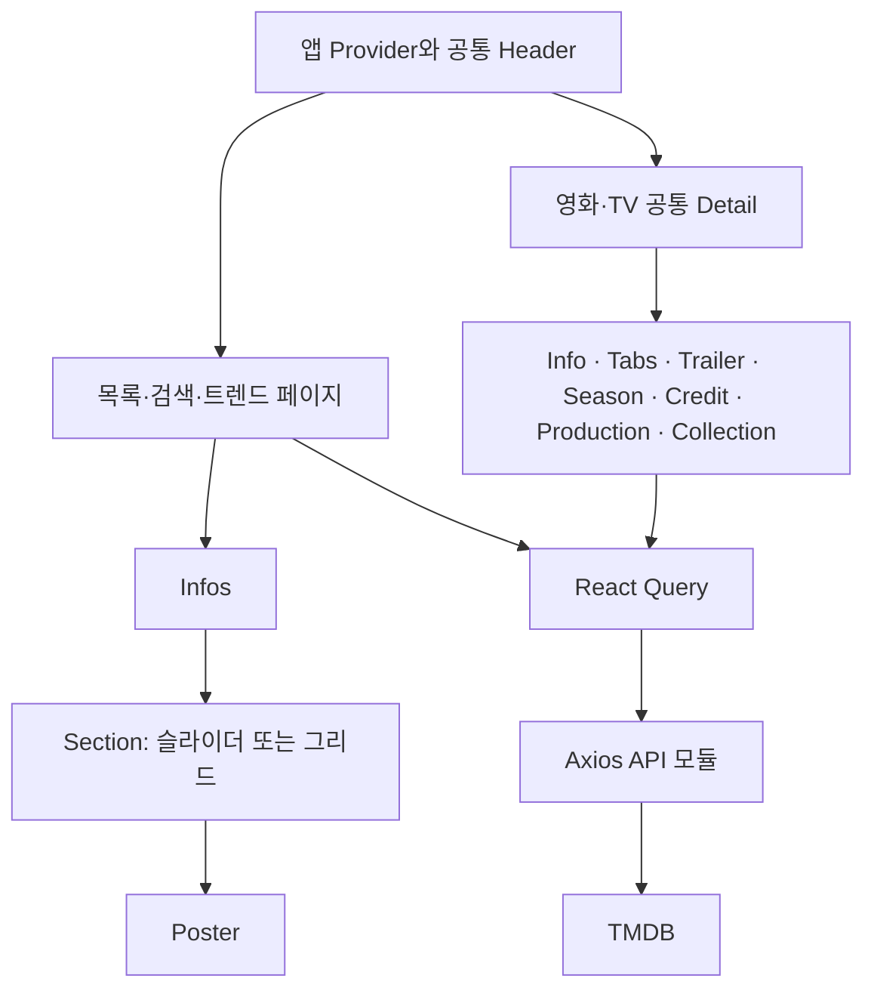

# 저장소 구조 및 개선점 진단

작성일: 2026-09-10 · 기준 커밋: `5be471a` (`main`)

> 이 문서는 전환 전 기준 커밋의 진단 결과를 보존한다. 이후 구현과 검증 상태는 [개선 작업 진행 기록](improvement-progress.md), 전환 후 구조는 [App Router·Tailwind 전환 기록](app-router-overhaul.md)에서 관리한다. 아래의 삭제된 파일 링크와 기술 구성은 당시 근거다.

이 문서는 현재 구현의 구조와 기술 개선점을 기록한다. UI/UX 개선 과제와 수용 기준은 [UI/UX 개선 백로그](ui-ux-backlog.md)에 별도로 정리한다. 두 문서의 개선 항목은 제안이며, 이번 작업에서 애플리케이션 코드나 의존성을 변경하지 않았다.

## 1. 개요

Jimmyflix는 TMDB 데이터를 이용해 영화와 TV 프로그램을 탐색하는 웹 앱이다. 실행 소스 및 도메인 타입 31개, 약 2,400줄 규모이며, 기준 커밋의 작성일은 2022-05-04다. 별도 DB, 회원 인증, 사용자 데이터 저장 기능은 없다.

공통 목록과 영화·TV 상세 화면의 재사용 구조를 유지하면서, 실행 환경 복구와 데이터 정확성 개선부터 단계적으로 진행하기에 적합하다.

| 영역 | 현재 구성 | 근거 |
| --- | --- | --- |
| 프레임워크 | Next.js 12.1.5, React 18.0.0, Pages Router | [package.json](../package.json), [yarn.lock](../yarn.lock) |
| 언어·스타일 | TypeScript strict 모드, Emotion, 커스텀 Babel 설정 | [tsconfig.json](../tsconfig.json), [.babelrc](../.babelrc) |
| 서버 데이터 | Axios → TMDB API, React Query v3 캐시 | [API 모듈](../pages/api/index.ts), [앱 Provider](../pages/_app.tsx) |
| 화면 상태 | Recoil atom 3개: 검색 여부, 검색어, 트렌드 기간 | [store.ts](../recoil/store.ts) |
| 패키지 관리 | Yarn 3.2.0, PnP, 저장소에 의존성 캐시 포함 | [.yarnrc.yml](../.yarnrc.yml), [.gitignore](../.gitignore) |
| 배포 문서 | README는 Vercel, package의 homepage는 Netlify를 가리킴 | [README](../README.md), [package.json](../package.json) |

## 2. 라우트와 컴포넌트

| 경로 | 역할 | 데이터 처리 |
| --- | --- | --- |
| `/` | 상영 중·고평점·개봉 예정·인기 영화 | SSR prefetch + React Query |
| `/tvs` | 고평점·인기·방송 중·오늘 방송 TV | SSR prefetch + React Query |
| `/trend` | 일간·주간 영화 및 TV 트렌드 | SSR prefetch + 기간별 React Query |
| `/search` | 영화·TV 검색 | 클라이언트 조회, Recoil 검색 상태 |
| `/movies/[id]` | 영화 상세 | SSR prefetch + 상세 탭 |
| `/tvs/[id]` | TV 상세 | SSR prefetch + 상세 탭 |
| 잘못된 경로 | 404 안내 | 5초 뒤 홈으로 자동 이동 |

- [pages/_app.tsx](../pages/_app.tsx): 전역 스타일, React Query Provider/Hydrate, RecoilRoot, Header를 조합한다.
- [components/common](../components/common): 목록·포스터·슬라이더·상태 안내·헤더를 재사용한다.
- [components/detail/index.tsx](../components/detail/index.tsx): 영화·TV 상세를 공유하고 탭에 맞는 패널을 렌더한다. Credit과 Collection은 해당 패널이 마운트될 때 조회한다.
- [pages/api/index.ts](../pages/api/index.ts): 실제 HTTP 핸들러가 아닌 외부 API 호출 함수 모음이다. API 라우트 디렉터리에 라이브러리 코드를 둔 상태다.

## 3. 데이터와 렌더링 흐름

직접 접근한 목록·트렌드·상세 페이지는 `getServerSideProps → prefetchQuery → dehydrate → Hydrate → useQuery/useQueries` 흐름을 사용한다. 페이지의 `getServerSideProps`마다 prefetch용 QueryClient를 생성한다.

[utils.ts](../utils.ts)의 `isClientReq`는 요청 URL이 `/_next`로 시작하면 빈 props를 반환하도록 각 페이지에서 사용된다. 내부 이동 때 서버 prefetch를 생략하려는 구현이다. 실제 Next 라우팅과 URL 정규화에 따른 모든 분기 동작은 검증하지 않았으므로, 렌더링 전략 정비 시 직접 진입·내부 이동·새로고침을 각각 확인해야 한다.

클라이언트 캐시는 기본 staleTime이 1분이지만 mount·reconnect·window focus 재조회가 모두 꺼져 있다. 이는 “1분마다 자동 갱신”을 의미하지 않는다. 검색어와 트렌드 기간은 URL에 없고 Recoil 메모리에만 존재한다.

## 4. 우선 기술 개선점

우선순위는 P1(실행·데이터 정확성), P2(유지보수·사용성·성능), P3(정리)로 구분한다. 상태의 “확인”은 코드 또는 별도 실행 검증으로 근거를 확보했다는 의미이며 모든 사용자 경로에서 장애를 재현했다는 뜻은 아니다.

| ID | 우선순위 | 확인 사항과 영향 | 개선 방향 | 근거 |
| --- | --- | --- | --- | --- |
| TECH-01 | P1 | Node 22.23.0에서 기본 Yarn 빌드·검사 명령이 `ERR_LOADER_CHAIN_INCOMPLETE`로 실패한다. Node 버전 지정도 없다. | 지원 Node/Yarn 조합 명시, 로더 및 실행 환경 정비, 새 체크아웃 재현 확인 | [.yarnrc.yml](../.yarnrc.yml), [.pnp.loader.mjs](../.pnp.loader.mjs), [package.json](../package.json) |
| TECH-02 | P1 | ESLint가 참조하는 `eslint-config-next`가 없어 설정 로드에 실패한다. `next/babel`은 Babel preset이며 lint extends에 들어 있다. | lint 설정과 의존성 정합성 복구, lint/typecheck/test 스크립트와 CI 추가 | [.eslintrc.json](../.eslintrc.json) 2행, [package.json](../package.json) |
| TECH-03 | P1 | 출연진 키 `['credit', id]`에 영화·TV 구분이 없다. 같은 숫자 ID의 두 콘텐츠가 서로의 출연진을 재사용하는 현상을 별도 실행으로 재현했다. | `['credits', mediaType, id]`처럼 요청을 결정하는 값 전체를 키에 포함 | [Credit.tsx](../components/detail/Credit.tsx) 16–21행 |
| TECH-04 | P1 | 트렌드 경로에 `Day`/`Week`를 보내지만 공식 계약은 `day`/`week`다. 배포의 기본 Day 화면에서 영화·TV 오류 안내도 관찰했다. 네트워크 원인은 추적하지 않아 명세 불일치와 오류의 인과관계는 확정하지 않았다. | API 값은 소문자 union으로 고정하고 UI 라벨과 분리, 실제 응답·오류 원인 확인 | [API 모듈](../pages/api/index.ts) 92–98행, [TimeType](../interface.d.ts) 85행 |
| TECH-05 | P1 | 국가 목록의 `map` 안에서 `useId()`를 호출한다. 목록 개수가 달라지면 Hook 호출 순서·개수 문제가 생길 수 있다. | `country.iso_3166_1`을 안정적인 key로 사용 | [Production.tsx](../components/detail/Production.tsx) 47–48행 |
| TECH-06 | P2 | Helmet의 서버 결과를 문서 head에 삽입하는 연동이 없다. 사용 중인 라이브러리의 별도 서버 렌더에서 title이 출력 HTML에 포함되지 않음을 확인했다. | `next/head`로 제목 관리, 상세 description·OG·canonical 추가, 응답 HTML 확인 | [Helmet.tsx](../components/common/Helmet.tsx), [_document.tsx](../pages/_document.tsx) |
| TECH-07 | P2 | 독립적인 SSR 목록 요청 4개를 순서대로 기다린다. 응답 시간이 합산된다. | `Promise.all`로 병렬화하고 실패 처리는 섹션별로 분리 | [홈](../pages/index.tsx) 105–108행, [TV](../pages/tvs/index.tsx) 107–110행 |
| TECH-08 | P2 | Provider의 QueryClient가 모듈 범위에 있어 서버 렌더 요청 사이에 공유된다. | 앱 인스턴스별로 생성해 요청 수명을 분리. 현재 공개 데이터 앱이므로 개인정보 유출로 단정하지 않음 | [_app.tsx](../pages/_app.tsx) 39–54행 |
| TECH-09 | P2 | `detail: any`, 영화와 TV를 동시에 필수로 합친 `IContent`, 배열 대신 빈 튜플 `[]` 등 실제 응답과 다른 타입이 있다. | 영화·TV 구분 union, 상세 응답과 nullable 필드, 정확한 배열 타입 정의 | [interface.d.ts](../interface.d.ts) 14–30행, [Detail](../components/detail/index.tsx) 19행, [Info](../components/detail/Info.tsx) 9행 |
| TECH-10 | P2 | 상세 메뉴가 최초 effect에서만 결정되어 같은 인스턴스에서 작품이 바뀌면 이전 메뉴가 남을 수 있다. | Collection/Season 메뉴를 props에서 매 렌더 도출 | [Tabs.tsx](../components/detail/Tabs.tsx) 24–36행 |
| TECH-11 | P2 | API 라이브러리가 라우트 디렉터리에 있고, 브라우저에서도 `NEXT_PUBLIC_API_KEY`로 TMDB를 직접 호출한다. | 라이브러리를 별도 모듈로 분리. 키를 서버에서 관리하려면 실제 API 핸들러·요청 제한·캐시 설계 | [API 모듈](../pages/api/index.ts) 5–11행 |
| TECH-12 | P2 | 유효하지 않은 상세 ID 검증과 TMDB 404의 `notFound` 매핑이 없다. | ID 검증, 404와 일시 오류 구분, 재시도 및 복귀 경로 제공 | [영화 상세](../pages/movies/[id].tsx), [TV 상세](../pages/tvs/[id].tsx) |
| TECH-13 | P3 | TV 페이지 Header 중복, 페이지 간 Container import, 상세 자식이 부모의 스타일을 import하는 순환 의존이 있다. | 공용 layout·styles 분리, TV의 추가 Header 제거 | [TV](../pages/tvs/index.tsx) 5·65행, [Credit](../components/detail/Credit.tsx) 2행, [Detail](../components/detail/index.tsx) 13행 |

## 5. 유지보수와 성능

- **지원 버전으로 업그레이드:** 확인일 기준 Next.js 12는 공식 지원 종료 상태다. Pages Router를 유지한 상태에서도 지원 버전으로 단계적으로 이동할 수 있다. App Router 전환은 별도 범위로 판단한다.
- **상태 관리 단순화:** Recoil 공식 저장소는 2025-01-01 보관 처리됐다. 여기서는 atom 3개만 사용하므로 검색어·기간을 URL에 옮기고 나머지를 React 상태로 관리할 여지가 크다.
- **캐시 정책 명시:** 검색 실행 조건은 API 함수 내부의 `isSearched` 분기 대신 query의 `enabled`로 표현하고, 갱신 주기를 사용자 기대에 맞게 정한다.
- **이미지 전송 최적화:** 일반 Poster는 이미 `w300`을 사용한다. 상세 포스터·출연진·시즌·제작사 이미지는 `original`을 쓰므로 표시 크기에 맞게 조정하고 지연 로딩을 검토한다. 전송량과 LCP 개선 수치는 아직 측정하지 않았다.
- **외부 스타일 의존 정리:** slick 패키지는 1.8.1인데 문서는 CDN의 1.6.0 CSS를 로드한다. 설치 버전의 스타일로 통합하고 커스텀 Babel·polyfill·미사용 의존성은 업그레이드 시 함께 점검한다.
- **온보딩 문서 보강:** 환경 변수의 역할과 공개 범위, 지원 런타임, 실행·검증·배포 절차를 기록한다. 배포 플랫폼 표기도 실제 운영 설정 확인 후 통일한다.

## 6. 검증 기록과 한계

| 확인 항목 | 결과 |
| --- | --- |
| 소스·설정·lockfile 검토 | 완료. 앱 소스와 의존성 변경 없음 |
| 기본 `yarn build`에 해당하는 저장소 Yarn CLI 실행 | 현재 Node 22.23.0에서 PnP ESM 로더 오류로 실패 |
| CJS PnP를 직접 로드한 TypeScript 검사 | 통과. 타입의 정확성과 런타임 동작까지 보장하지는 않음 |
| CJS PnP로 ESLint 설정 로드 | `Failed to load config "next/core-web-vitals"` 재현 |
| 출연진 캐시 검증 | 동일 키로 movie 데이터 조회 후 tv 조회 시 movie 결과 재사용, tv fetch 미실행 |
| Helmet 서버 렌더 검증 | 렌더 HTML은 빈 문자열, title은 별도로 추출해야 하는 context에만 존재 |
| 전체 프로덕션 빌드 | 성공 확인 안 됨 |
| 자동 테스트·CI | 저장소에 테스트 파일과 CI 정의, lint/test/typecheck 스크립트 없음 |
| 배포 화면 부분 관찰 | 데스크톱 1280×720 홈, 모바일 크기 390×844 홈·검색·영화 상세·트렌드 확인. 검색 결과 조회와 상세 이동 성공, 트렌드는 오류 문구 표시. 실제 터치 기기 또는 전체 E2E 검증은 아님 |
| 접근성·성능 지표 | 전체 키보드/스크린리더 검증, Lighthouse·Core Web Vitals 측정 안 함 |

브라우저 관찰은 배포 URL의 당시 상태이며 기준 커밋과 동일한 배포라는 보장은 없다. 배포 화면의 추가 관찰과 UI/UX 항목별 검증 범위는 [UI/UX 개선 백로그](ui-ux-backlog.md)를 따른다. 오래된 의존성이라는 사실만으로 특정 취약점의 실제 악용 가능성이나 배포 장애를 단정하지 않는다.

## 7. 권장 작업 순서

1. 실행 환경·lint 복구, 지원 런타임과 검증 명령 문서화.
2. 캐시 키·트렌드 요청값·Hook 오류 수정과 해당 회귀 검증.
3. 모바일 재검색, 로딩·오류 복구, 헤더 중복 등 기존 사용 흐름 개선.
4. 타입·API 계층·URL 상태·SSR 병렬화·메타데이터 정리.
5. 지원 프레임워크 버전으로 업그레이드하고 핵심 경로 회귀 확인.
6. 이미지·레이아웃·접근성 개선 후 실제 기기와 성능 지표로 확인.

구조·의존성 변경은 작은 단위로 나누고 각 단계에서 직접 진입, 내부 이동, 새로고침, 뒤로가기, 외부 API 실패를 확인한다. 이 순서는 향후 작업 제안이며 구현 착수나 배포 승인 상태를 의미하지 않는다.

## 8. 공식 참고 자료

- [Next.js 지원 정책](https://nextjs.org/support-policy): Next.js 12 지원 종료 확인.
- [Next.js Pages Router](https://nextjs.org/docs/pages): 현재도 지원하는 라우팅 방식.
- [Next.js Head](https://nextjs.org/docs/pages/api-reference/components/head): 페이지 메타데이터 처리.
- [Next.js API Routes](https://nextjs.org/docs/15/pages/building-your-application/routing/api-routes): API 파일의 라우팅 역할.
- [React Query v3 query keys](https://tanstack.com/query/v3/docs/framework/react/guides/query-keys): 요청 변수와 캐시 키 관계.
- [React useId](https://react.dev/reference/react/useId): 반복문 호출 및 목록 key 사용 제약.
- [TMDB Trending Movies](https://developer.themoviedb.org/reference/trending-movies): `day`/`week` 요청 계약.
- [Recoil 공식 저장소](https://github.com/facebookexperimental/Recoil): 2025-01-01 보관 처리.
